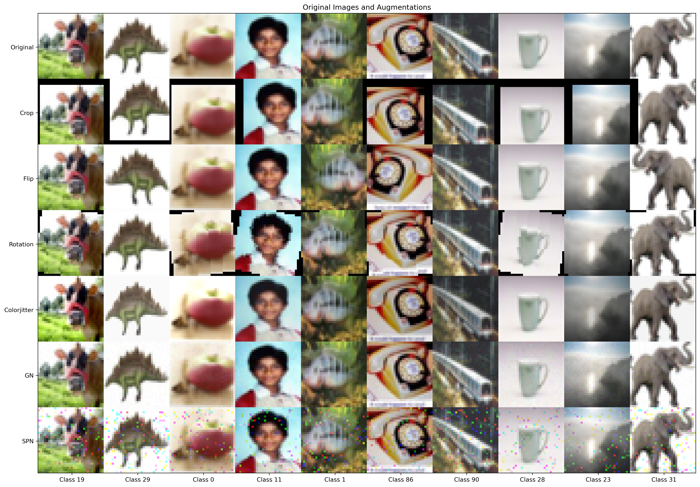
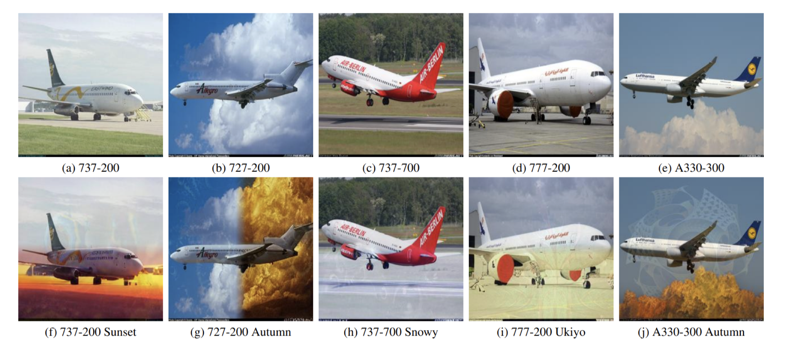

# Exploring the Effect of Data Augmentation on Image Classification Tasks

### Abstract

This paper investigates the impact of various data augmentation techniques on model performance across different datasets. We employ ResNet-18 and Vision Transformer as base model architectures, conducting experiments on CIFAR-10, CIFAR-100, and Fashion-MNIST datasets. Our study encompasses both tra-ditional and deep learning-based augmentation methods. Results indicate that among traditional data augmentation methods, Crop demonstrates superior per-formance, while Flip and Rotation exhibit comparable effectiveness. Both tech-niques enhance model generalization and mitigate overfitting effects. How-ever, pixel-level augmentation methods do not consistently yield positive out-comes. And the DiffuseMix method achieves improvements over the base-line while utilizing one-fifth of the augmented data.  

### Augmented data
#### Traditional Methods

#### Deep learning Method

### Results

| Dataset       | Model     | Beseline | Crop      | Flip      | Rotation  | CJ    | GN    | SPN   | DiffuseMix |
| ------------- | --------- | -------- | --------- | --------- | --------- | ----- | ----- | ----- | ---------- |
| Cifar-10      | Resnet-18 | 89.80    | **94.26** | 92.49     | 91.99     | 89.47 | 88.75 | 89.21 | 90.19      |
| Cifar-10      | Vit       | 76.92    | **83.58** | 79.63     | 80.39     | 77.72 | 74.51 | 75.41 | 78.84      |
| Cifar-100     | Resnet-18 | 63.37    | **76.32** | 70.10     | 70.51     | 62.74 | 62.14 | 63.27 | **78.57**  |
| Cifar-100     | Vit       | 57.17    | **62.85** | 59.74     | 59.20     | 59.46 | 57.38 | 54.65 | 58.43      |
| Fashion-Mnist | Resnet-18 | 99.59    | 99.65     | 99.43     | **99.71** | 99.66 | 99.68 | 99.64 | -          |
| Fashion-Mnist | Vit       | 90.69    | 91.21     | **91.68** | 90.38     | 89.52 | 91.31 | 90.64 | -          |

